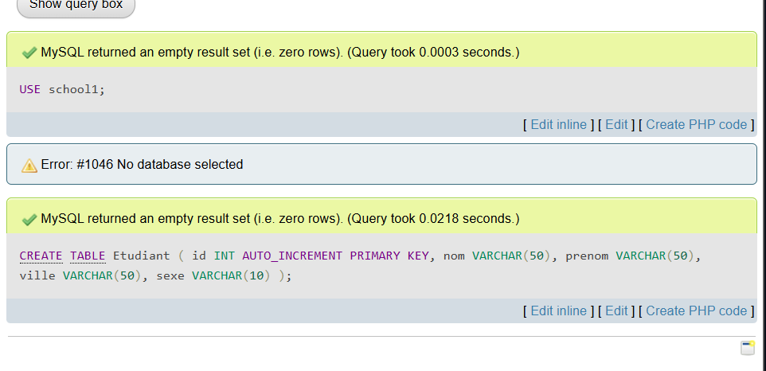
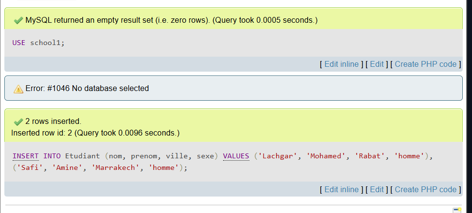
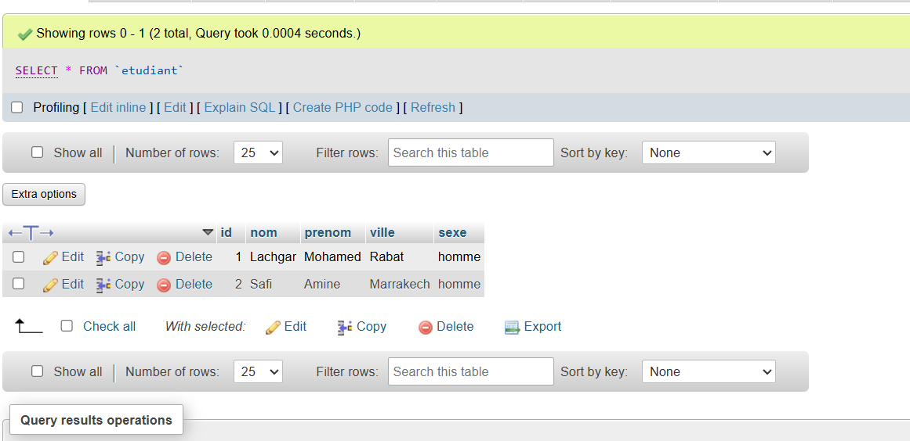
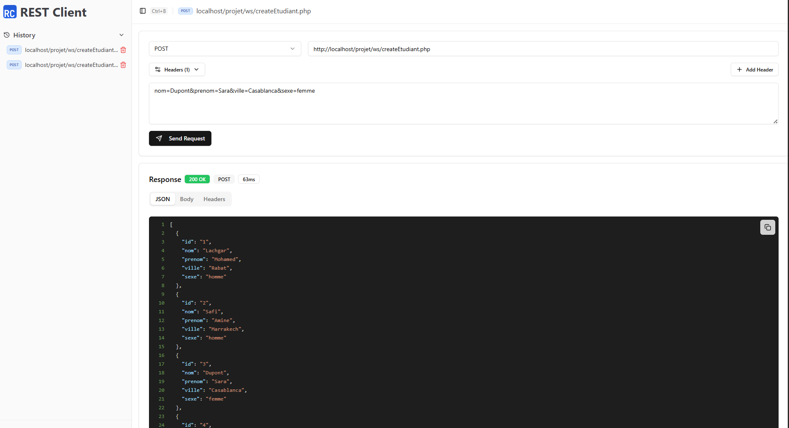
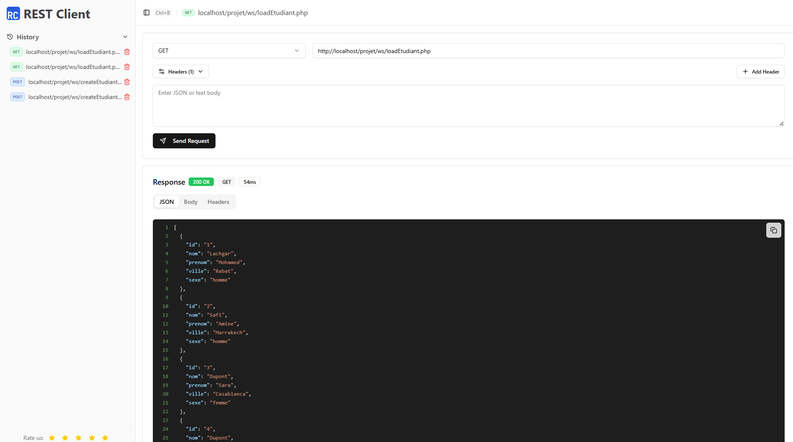
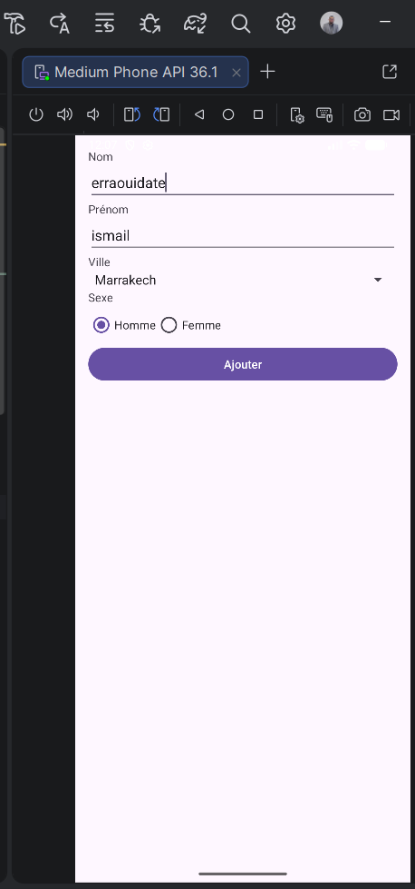
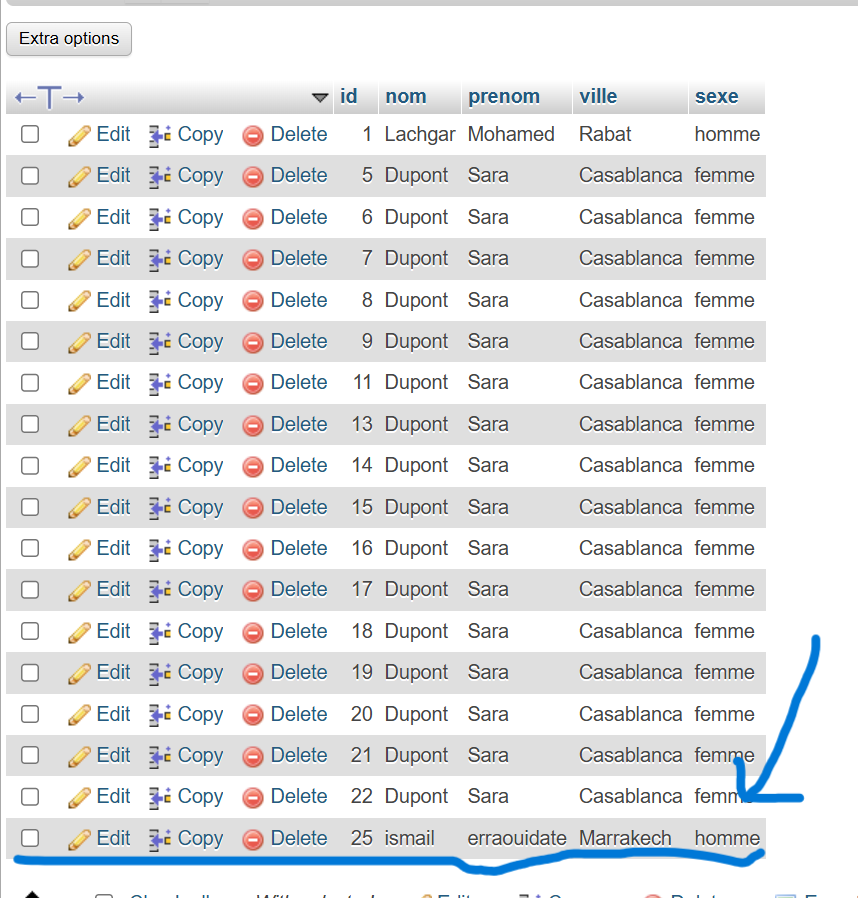

# Projet WS — Gestion des Étudiants

## Objectifs

- Mise en place d’une base MySQL  
- Création d’un Web Service PHP  
- Développement d’une application Android  
- Traitement du JSON avec Gson  

---

## Partie 1 — Base MySQL

### Démarrage
- Ouverture de XAMPP  
- Démarrage de Apache et MySQL  
- Accès à phpMyAdmin  

### Base de données
- Création de la base **school1**

### Table
- Création de la table **Etudiant**  
- Champs : id, nom, prenom, ville, sexe  

### Test
- Insertion de quelques étudiants  

---

## Partie 2 — Web Service PHP

### Structure du projet
- Création du projet PHP  
- Mise en place des dossiers : classes, connexion, dao, service, controller, ws  
- Déploiement du projet dans **htdocs**

### Connexion à la base
- Création de la classe **Connexion (PDO)**  
- Liaison avec la base **school1**

### Classe Etudiant
- Création de la classe **Etudiant**  
- Définition des champs principaux  
- Ajout des getters

### Interface IDao
- Déclaration des opérations CRUD  
- Méthodes : create, delete, update, findAll, findById  

### Service EtudiantService
- Implémentation de **IDao**  
- Fonction d’ajout d’un étudiant  
- Fonction de récupération de la liste  

### Web Services
- **createEtudiant** : ajout (POST)  
- **loadEtudiant** : lecture (GET)  
- Réponse renvoyée en JSON  

### Test avec ARC / Postman
- Installation de l’outil de test  
- Test du POST (ajout)  
- Vérification dans phpMyAdmin  
- Test du GET (lecture)  
- Validation du JSON  

### Remarque
- Validation des services avant la partie Android  

---

## Partie 3 — Application Android (Volley + Gson)

### Création du projet Android
- Lancement de Android Studio  
- Création du projet **projetws** (Java, API ≥ 26)  
- Vérification du build  

### Permission Internet
- Ajout de la permission Internet  
- Autorisation des requêtes HTTP  

### Dépendances
- Ajout de **Volley** et **Gson**  
- Synchronisation du projet  

### Activité AddEtudiant
- Création de l’interface d’ajout  
- Saisie des informations étudiant  
- Bouton d’envoi  

### Communication avec le Web Service
- Envoi de la requête POST via Volley  
- Réception de la réponse JSON  
- Parsing avec Gson  
- Affichage dans Logcat  

### Configuration réseau (Android 9+)
- Autorisation du trafic HTTP local  
- Ajout du fichier de sécurité réseau  
- Mise à jour du manifest  

### Test de l’application
- Démarrage Apache et MySQL  
- Lancement de l’application  
- Ajout d’un étudiant  
- Vérification dans Logcat  

---
